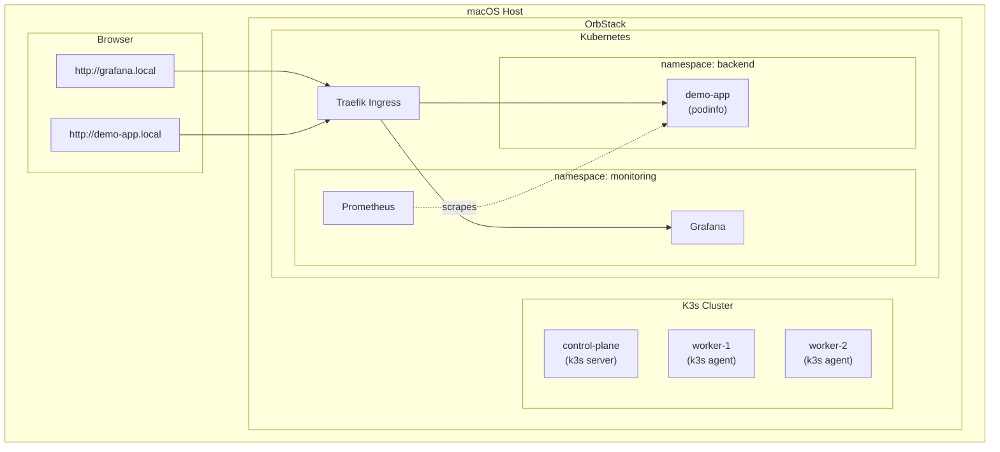

# Kios
Local Kubernetes cluster setup using k3s in OrbStack.

## Features
- K3s cluster in OrbStack
  - K3s is a production-grade certified kubernetes distribution
  - OrbStack is a fast, light, and easy engine to run VMs
- Multi-Node cluster using VMs (not kubernetes in docker)
- Terraform/Terragrunt for environment layers
- Helm charts locally developed and ready to deploy
- Base local environment
  - 3-node k3s cluster
  - Prometheus stack (kube-state-metrics, prometheus, grafana) -> `http://grafana.local`
  - Demo app (using a local helm chart + [podinfo](https://github.com/stefanprodan/podinfo)) -> `http://demo-app.local`

## Benefits
Develop locally with production-like environment before deploying to the cloud:
- Simulate production-like workload traffic and failure modes
- Test infrastructure changes (terraform, terragrunt, helm)
- Use performance tools (e.g. eBPF-based tools) in kubernetes nodes

## Prerequisites
```
brew tap hashicorp/tap
brew install orbstack k3sup kubectl k9s terraform terragrunt
```

## Quick Start
1. Create the cluster
```bash
make -C ./k3s-in-orbstack vms
make -C ./k3s-in-orbstack install

# Test
export KUBECONFIG=./k3s-in-orbstack/kubeconfig
kubectl get nodes
# or
k9s --kubeconfig=./k3s-in-orbstack/kubeconfig    
```
2. Apply infrastructure layers
```bash
terragrunt apply --working-dir=terraform/environments/local/01-k8s-critical-addons
terragrunt apply --working-dir=terraform/environments/local/02-k8s-addons

# Test
kubectl get pods -n monitoring
kubectl get pods -n backend
```
3. Access services
```bash
# OPTION 1: PORT FORWARDING
# Demo App (http://localhost:9898)
kubectl port-forward -n backend svc/demo-app 9898:9898

# Grafana (http://localhost:3000, username/password: admin/admin)
kubectl port-forward -n monitoring svc/kube-prometheus-stack-grafana 3000:80

# OPTION 2: INGRESS (http://demo-app.local, http://grafana.local)
echo "$(orb info control-plane | awk '/IPv4:/ {print $2}') demo-app.local grafana.local" | sudo tee -a /etc/hosts
```
You can find the demo dashboard at `Dashboards > Demo Dash`

## Architecture



## Directory Structure
```
kios/
├── k3s-in-orbstack/
│   └── Makefile                   # k3s cluster setup/teardown
├── helm-charts/
│   └── demo-app/                  # Demo app Helm chart
├── terraform/
│   ├── modules/
│   │   ├── backend/               # demo-app deployment
│   │   └── monitoring/            # Prometheus stack
│   └── environments/
│       └── local/
│           ├── root.hcl
│           ├── 01-k8s-critical-addons/
│           └── 02-k8s-addons/
└── README.md
```

## Teardown
```bash
# Destroy k3s cluster (everything)
make -C ./k3s-in-orbstack teardown

# Destroy terragrunt local env only
terragrunt run --all destroy --working-dir=terraform/environments/local
```
